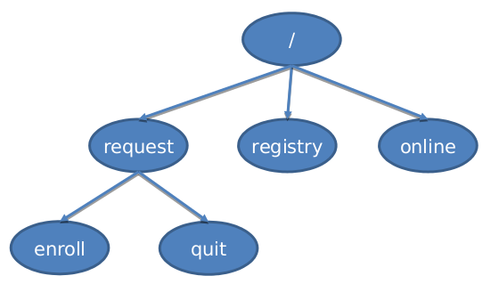

# RetroChat

A chat system working on command line, implemented upon Apache Zookeeper and Apache Kafka, for the course *Large Scale System Project* at Universidad Politecnica of Madrid.

## System architecture

  

The architecture is a classic Manager - Workers approach.\
A single manager is in charge to build the above tree and manages all the client requests, (re)setting the watchers under the main nodes every time a client appends his requests.\
Messages are managed by Kafka with topics. Every user has an associated topic (with his same name) that represent his *inbox*. Selecting a receiver when sending messages, means writing contents in his associated topics.

## Main menu

## 1. Register

Workers (clients) request to be registered in the system, appending a Zookeeper node under `/request/enroll`. The manager check the client name is not present yet, and confirms the registration deleting the request, and pushing a new node under `/registry`.

## 2. Go online

The client ask to go online, appending a new `ephimeral` node under `/online`. The manager checks if it already exists a Kafka topic associated to the client, if not, it creates the topic (it will be his inbox).

## 3. Quit

Similar to Register, the reference node for requesting quit is `/request/quit`. The manager then removes the node from `/registry`.

## 4. Send messages

| |  |
|:--:|:--:|

A user need to be online in order to send messages to other online clients. A list of online users can be also retrieved inside this menu. Once specified the receiver user name, the messages will be published under the receiver related topic.

## 5. Watch online clients

Retrieve all online clients in the system to which I can send messages to. The same function can be invocated from the ***send messages*** menu

## 6. Read messages

 
A user need to be online in order to read his messages. It then consumes all the contents associated to his related topic.
That is, messages are always shown from the beginning.

## Notes

If you want more details, please have a look at the [project specification](spec/ZookeeperSimpleProject.pdf) or at the [presentation slides](spec/ZookeeperSlides.pdf)
